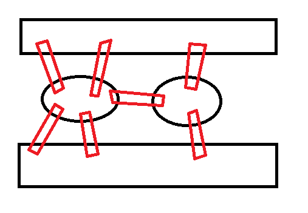
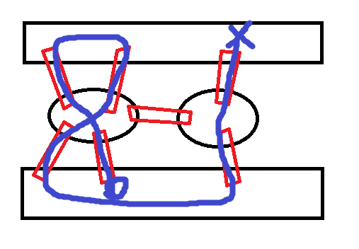
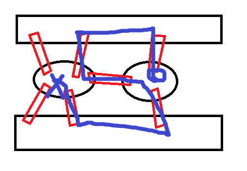
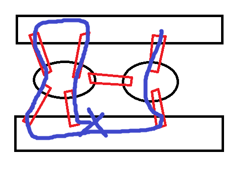
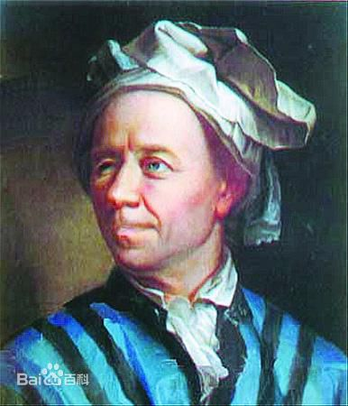
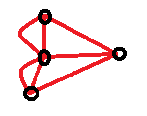
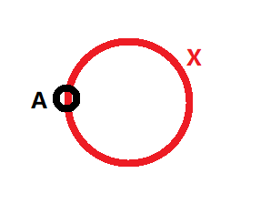
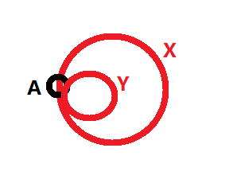
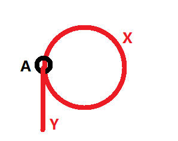
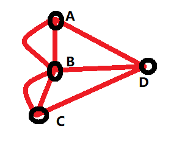

## 图论：0.0 哥尼斯堡七桥问题的证明

很久很久以前，有个大名鼎鼎的地方，叫哥你是宝（大雾）。。

哥你是宝有一条河，河里有两座小岛，两座小岛和周边的陆地总共有七座桥连接起来。这里风景优美，空气新鲜，以至于很多市民都喜欢来这边旅游观光。

.风景优美，空气新鲜的哥尼斯堡七桥

[NOTE]
红色方框表示桥，黑色方框表示陆地。

慢慢的，乐于游玩的市民们就想到一个问题：
有没有一种办法，可以从任意一个地方出发，然后恰巧每个桥只经过一次，观赏完所有风景之后又回到起点呢？

市民们使用了各种方式：

.这样的

.这样的

.这样的

……

但不管怎么样都做不到。。

于是有人把这个问题写了封信，寄给了当时大名鼎鼎的数学家欧拉，

欧拉花了一年时间，最终证明了这个问题是无解的！

那么怎么去证明这个问题无解嘞？

我们可以先把地图模型简化成这样的二维模型：

.风景优美，空气新鲜的哥尼斯堡七桥

[NOTE]
红色方框表示桥，黑色方框表示陆地。这地方漂亮极了。

于是简化成了四个点、七条边，如何证明一个图形，从任意一点出发，每条边仅经过一次，最终又回到起点呢？

这个问题还是有点复杂，我们再对问题做一次简化，把七条边简化成一条，把四个点简化成一个点，那么得到如下模型：

.简化版的陆地和桥

这……这不就是一个圆嘛！！

所以，七桥问题其实等同于画圆问题！

不管有几个顶点，也不管有几条边，从一点出发最终回到该点，本质上就是画圆。

所以对于上述证明问题，本质上就是求解能否在图形上构造出一个圆。

对“简化版的陆地和桥”做一层抽象，其实图中只具备两个元素：

A岛：连接着X桥。
X桥：首尾两端都连接着A岛。

我们可以得出一个结论，在最简单的情况下，从能够从A点画圆的充要条件为：A点必须具备一个出口，同时也必须具备一个入口。

之后我们再做一次扩展，为A岛再建造一座桥：

.稍微复杂一点的陆地和桥

路线不管是 A -> X -> A -> Y -> A 还是 A -> Y -> A -> X -> A，依然可以回到原点。

A岛：连接着X桥。
X桥：首尾两端都连接着A岛。
Y桥：首尾两端都连接着A岛。

此时，A岛具备了两个入口和两个出口。

我们还可以再建造第三座桥、第四座桥，但不管建造几座桥，A点的出口必须等于入口的总数，否则圆就会不成立：

.只有出口或只有入口的A岛

然后我们再回过头来看我们的“七桥”。

.风景优美、空气新鲜的七桥

A、B、C、D四个点所具备的出口或入口数量为：

A、C、D：3
B：5

这就意味着它没有能够画圆的起点和终点，因此该问题是无解的！

这一小节中，我们证明了七桥问题本质上是个画圆问题，并且证明了七桥问题是无解的，同时窥探了一些图的性质。

当然，欧拉大师并不是这么证明七桥问题无解的。

在下一小节，我们再研究画圆除了必须具备至少一个偶数个入口或出口的点以外，还需要具备哪些特性。

to be continue......
